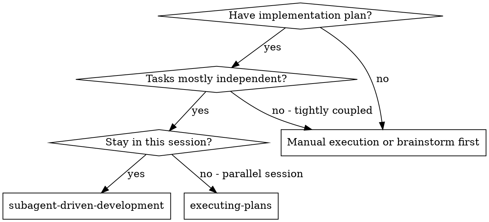
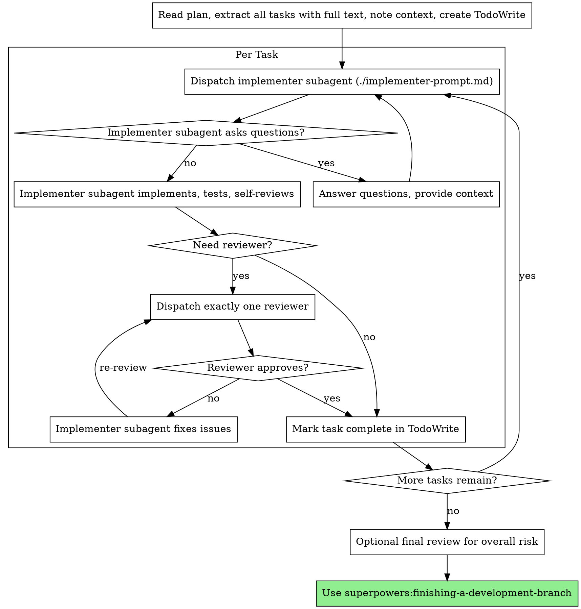

# Subagent-Driven Development

Execute a plan by dispatching a fresh implementer subagent per task. Default Superpowers execution is now fast-by-default: implementer self-review is mandatory, but reviewer subagents are conditional instead of automatic.

**Why subagents:** You delegate tasks to specialized agents with isolated context. By precisely crafting their instructions and context, you ensure they stay focused and succeed at their task. They should never inherit your session's context or history — you construct exactly what they need. This also preserves your own context for coordination work.

**Core principle:** Fresh subagent per task + strong self-review + risk-based reviewer escalation = fast iteration without losing the ability to tighten quality gates when needed.

## When to Use



**vs. Executing Plans (parallel session):**
- Same session (no context switch)
- Fresh subagent per task (no context pollution)
- Easier to keep tasks isolated
- Reviewer escalation only when the task or result warrants it

## The Process



## Model Selection

Use the least powerful model that can handle each role to conserve cost and increase speed.

**Mechanical implementation tasks** (isolated functions, clear specs, 1-2 files): use a fast, cheap model. Most implementation tasks are mechanical when the plan is well-specified.

**Integration and judgment tasks** (multi-file coordination, pattern matching, debugging): use a standard model.

**Architecture, design, and review tasks**: use the most capable available model.

**Task complexity signals:**
- Touches 1-2 files with a complete spec → cheap model
- Touches multiple files with integration concerns → standard model
- Requires design judgment or broad codebase understanding → most capable model

## Handling Implementer Status

Implementer subagents report one of four statuses. Handle each appropriately:

**DONE:** If the task is low-risk and verification passed, mark it complete. If risk triggers are present, dispatch exactly one reviewer.

**DONE_WITH_CONCERNS:** The implementer completed the work but flagged doubts. Read the concerns first. If they point to correctness, scope, compatibility, or maintainability risk, dispatch one reviewer before accepting the task.

**NEEDS_CONTEXT:** The implementer needs information that wasn't provided. Provide the missing context and re-dispatch.

**BLOCKED:** The implementer cannot complete the task. Assess the blocker:
1. If it's a context problem, provide more context and re-dispatch with the same model
2. If the task requires more reasoning, re-dispatch with a more capable model
3. If the task is too large, break it into smaller pieces
4. If the plan itself is wrong, escalate to the human

**Never** ignore an escalation or force the same model to retry without changes. If the implementer said it's stuck, something needs to change.

## When to Escalate to a Reviewer

Reviewer subagents are conditional. Dispatch **exactly one** reviewer when one or more of these are true:

- The implementer returns `DONE_WITH_CONCERNS`
- The change appears to exceed the task scope
- The task touches a public interface, migration, compatibility path, or destructive change
- Verification results are unstable or ambiguous
- You believe the task is at high risk of drifting from the plan

Choose the reviewer based on the risk:

- **Spec reviewer** when the main risk is "did we build the right thing?"
- **Code quality reviewer** when the main risk is maintainability, decomposition, or implementation quality

If the human explicitly wants the old two-review gate for every task, use `superpowers:subagent-driven-development-strict` instead.

## Prompt Templates

- `./implementer-prompt.md` - Dispatch implementer subagent
- `./spec-reviewer-prompt.md` - Dispatch spec compliance reviewer subagent
- `./code-quality-reviewer-prompt.md` - Dispatch code quality reviewer subagent

## Example Workflow

```
You: I'm using Subagent-Driven Development to execute this plan.

[Read plan file once: docs/superpowers/plans/feature-plan.md]
[Extract all 5 tasks with full text and context]
[Create TodoWrite with all tasks]

Task 1: Hook installation script

[Dispatch implementation subagent with full task text + context]

Implementer:
  - Implemented install-hook command
  - Added tests, 5/5 passing
  - Self-review: Found I missed --force flag, added it
  - Status: DONE

[Low-risk task, verification is clean]
[Mark Task 1 complete]

Task 2: Recovery modes

[Dispatch implementation subagent with full task text + context]

Implementer:
  - Added verify/repair modes
  - 8/8 tests passing
  - Concern: I had to touch a public CLI flag parser
  - Status: DONE_WITH_CONCERNS

[Dispatch spec reviewer because scope/CLI risk is high]
Spec reviewer: ❌ Issues:
  - Missing: Progress reporting (plan says "report every 100 items")

[Implementer fixes issues]
[Spec reviewer re-checks]
Spec reviewer: ✅ Spec compliant now

[Mark Task 2 complete]

...

[After all tasks]
[Optional final review only if overall risk warrants it]
Done!
```

## Advantages

**vs. Manual execution:**
- Fresh context per task (no confusion)
- Parallel-safe (subagents don't interfere)
- Subagent can ask questions (before AND during work)

**vs. Executing Plans:**
- Same session (no handoff)
- Continuous progress (no waiting)
- Conditional review without pausing every task by default

**Efficiency gains:**
- No file reading overhead (controller provides full text)
- Controller curates exactly what context is needed
- Subagent gets complete information upfront
- Questions surfaced before work begins (not after)

**Quality gates:**
- Self-review catches issues before handoff
- Reviewer escalation catches high-risk issues without paying the cost on every task
- Review loops still apply whenever a reviewer is brought in

**Cost:**
- Fewer reviewer invocations than the old workflow
- Faster end-to-end on low-risk task sets
- Still supports tighter gates when risk warrants it

## Red Flags

**Never:**
- Start implementation on main/master branch without explicit user consent
- Skip required verification
- Proceed with unfixed reviewer issues
- Dispatch multiple implementation subagents in parallel (conflicts)
- Make subagent read plan file (provide full text instead)
- Skip scene-setting context (subagent needs to understand where task fits)
- Ignore subagent questions (answer before letting them proceed)
- Accept "close enough" when a reviewer found issues
- Skip review loops (reviewer found issues = implementer fixes = review again)
- Let an implementer concern slide without deciding whether it needs review

**If subagent asks questions:**
- Answer clearly and completely
- Provide additional context if needed
- Don't rush them into implementation

**If reviewer finds issues:**
- Implementer (same subagent) fixes them
- Same reviewer re-checks
- Repeat until approved
- Don't skip the re-review

**If subagent fails task:**
- Dispatch fix subagent with specific instructions
- Don't try to fix manually (context pollution)

## Integration

**Required workflow skills:**
- **superpowers:using-git-worktrees** - REQUIRED: Set up isolated workspace before starting
- **superpowers:writing-plans** - Creates the plan this skill executes
- **superpowers:finishing-a-development-branch** - Complete development after all tasks

**Reviewer support:**
- **superpowers:requesting-code-review** - Code review template for quality reviewer subagents

**Alternative workflow:**
- **superpowers:executing-plans** - Use for parallel session instead of same-session execution
- **superpowers:subagent-driven-development-strict** - Use when the human explicitly wants the old two-stage review gate on every task
